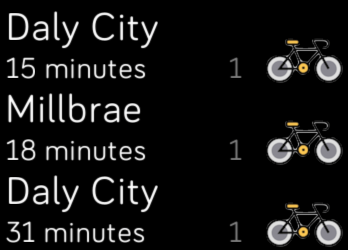

An app for checking when my favorite bus is coming to take me to Centre-ville.

To develop, use the Fitbit Studio SDK version 3.1 for Fitbit Versa Lite. Then use the Fitbit OS Simulator to run the code... However it may be more effective for versioning to use the CLI.

## Based upon...

# Bay Area Rapid Transit (BART)

Fitbit SDK example application which downloads real-time BART data and show
upcoming trains for a station of your choice.

Find out more information on the
[Fitbit Developer Website](https://dev.fitbit.com).

## License

This example is licensed under the [MIT License](./LICENSE).
